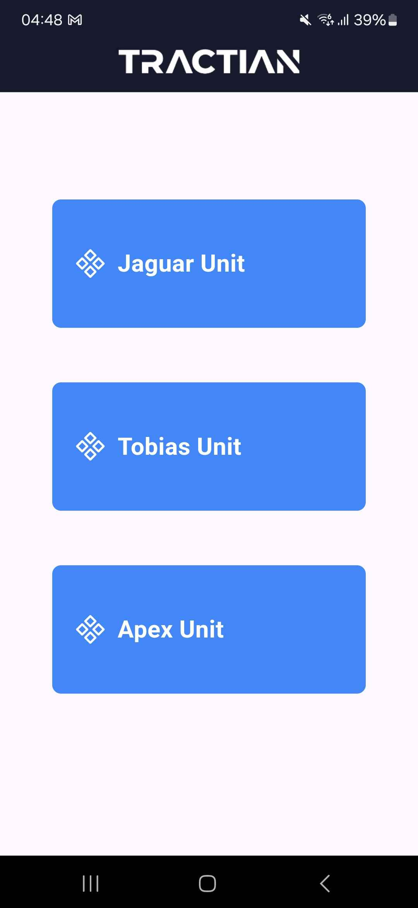

# Tractian Flutter Engineer Project

## Description
This Flutter application demonstrates efficient JSON data handling, well-organized widget trees, and the use of the GetX package for state management and routing. It showcases best practices for managing and displaying hierarchical data structures.

## Table of Contents
- [Installation](#installation)
- [Usage](#usage)
- [Core Features](#core-features)
- [Screenshots](#screenshots)
- [Big O Analysis](#big-o-analysis)

## Installation
1. Clone the repository
   ```sh
   git clone https://github.com/VHFroesVianna/tractian_flutter_engineer.git
   ```
2. Navigate to the project directory
   ```sh
   cd tractian_flutter_engineer
   ```
3. Install dependencies
   ```sh
   flutter pub get
   ```

## Usage
1. Run the application
   ```sh
   flutter run
   ```
2. Navigate through the app to explore the hierarchical data structure, efficient JSON data handling, and GetX features.

## Core Features
### Efficient JSON Data Handling
- **Parsing**: Utilizes efficient parsing techniques to handle large JSON files with minimal latency.
- **Filtering**: Implements robust filtering mechanisms to quickly and accurately filter data based on user input.

### Well-Organized Widget Tree
- **Modular Design**: The widget tree is designed to be modular, making it easy to maintain and extend.
- **Reusable Components**: Implements reusable widgets to ensure consistency and reduce redundancy across the app.
- **State Management**: Employs effective state management strategies to ensure smooth and responsive UI updates.

### Usage of GetX
- **State Management**: Leverages GetX for efficient and reactive state management, simplifying the process of updating the UI in response to data changes.
- **Routing**: Utilizes GetX for navigation and routing, providing a seamless and intuitive user experience.
- **Dependency Injection**: Takes advantage of GetX's dependency injection capabilities to manage dependencies in a clean and scalable manner.

## Screenshots

### Unit Selection Screen


### Main Assets Screen


### Search Functionality


### Sensor de Energia Filter


### Critical Assets Filter


### Shimmering Loading Screen


## Big O Analysis
### Efficiency of `loadAndOrganizeData` Method
The following graph demonstrates the time complexity of the `loadAndOrganizeData` method, which efficiently handles all JSON data with a complexity of O(n + m).


